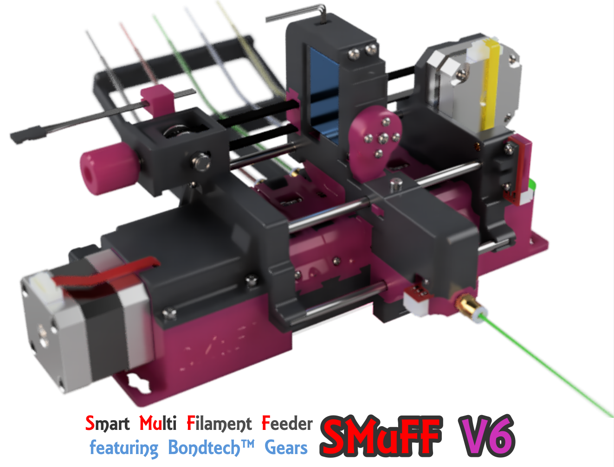
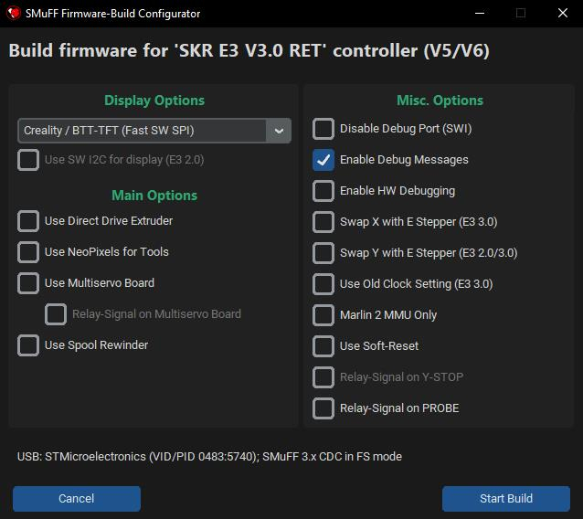
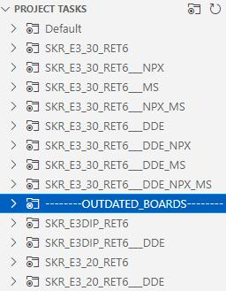
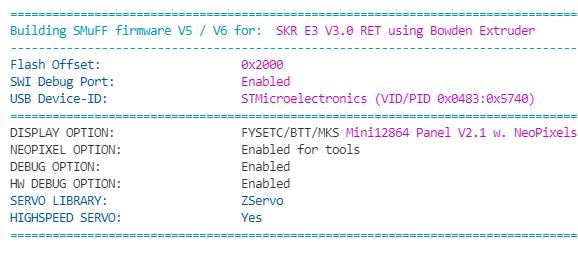

# Welcome to the SMuFF project

Here's the official firmware package for the **S**mart **Mu**lti **F**ilament **F**eeder, as published on [Printables](https://www.printables.com/de/model/194737-smuff-v6-smart-multi-filament-feeder-with-bondtech) and [Thingiverse](https://www.thingiverse.com/thing:3431438). Read the full story on how it came to life on my official [SMuFF homepage](https://sites.google.com/view/the-smuff/).

If you like this project and find it useful, you may consider [donating](https://sites.google.com/view/the-smuff/downloads/assembly-manual#h.m5ewgcp0jfk6).

To use this firmware, you have to [compile it](https://sites.google.com/view/the-smuff/how-to/tutorials/compile-the-firmware?authuser=0) and flash it to one of these (already supported) controller boards:

| Board |  |
|------------|-----|
| Bigtreetech [SKR mini E3 V3.0](https://www.biqu.equipment/products/bigtreetech-skr-mini-e3-v2-0-32-bit-control-board-for-ender-3) |**recommended** |
| Bigtreetech [SKR mini E3-DIP V1.1](https://www.biqu.equipment/products/bigtreetech-skr-e3-dip-v1-0-motherboard-for-ender-3)||
| Bigtreetech [SKR mini E3 V2.0](https://www.biqu.equipment/products/bigtreetech-skr-mini-e3-v2-0-32-bit-control-board-integrated-tmc2209-uart-for-ender-4) ||
| Bigtreetech [SKR mini V1.1](https://www.biqu.equipment/collections/control-board/products/bigtreetech-skr-mini-v1-1-motherboard-32-bit-arm-equipped-with-tmc2208-v2-1-tmc2130-spi-driver-stepstick-for-3d-printer-desktop?variant=20361870377058)||

The Bigtreetech SKR mini series boards are very small and yet powerful because of the 32-Bit STM Microcontroller Unit.

Of course, this firmware can also be configured to run on any other controller board, as long as it meets the specifications. Although you might be able to utilize older 8 bit boards, I don't recommended it - you'll most probably run out of memory (Flash/RAM) very soon. I recommend using a 32 bit controller board instead.
Make sure your board of choice has at least **256K** of Flash memory, **48K** of (S)RAM and all other components needed, which are at least:

+ two stepper motor drivers (sockets)
+ two endstop connectors
+ one servo connector (or two spare I/O pins for Software-I2C)
+ an onboard SD-Card
+ one spare serial port (USB or TTL)
+ a 128 x 64 pixel display connector
+ a rotary encoder connector

Simply create a new build environment in your **platformio.ini** and adopt the settings according to your controllers hardware in your custom **pins.h** file.

The configuration files **\*.json** and **debug.txt** have to be copied into the root folder of your SD-Card for the controller board. Hence, changing runtime parameters doesn't require recompiling the firmware. Just edit the settings from within the built-in menus or the [WebInterface](https://github.com/technik-gegg/SMuFF-WI), save them and reboot.

I've added the option to run GCode scripts for automated testing of your hardware.
In the **test** folder you'll find some sample scripts. Copy the folder over to your SD-Card and pick a script from within the menu to start the test run. Once started, the test will run infinitelly until you stop it.
Each test result will be displayed on the LCD and also sent to the log serial port (which is the USB port, if not defined otherwise).

For more information about building the SMuFF and some more detailed stuff, head over to my official [SMuFF homepage](https://sites.google.com/view/the-smuff/) or to my [Discord server](https://discord.com/invite/BzZ3rBf).

 

---

## Credit where credit is due

A special thanks to the folks who have created the following (Arduino) libraries, on which the SMuFF firmware builds upon:

+ [Adafruit](https://github.com/technik-gegg/Adafruit-PWM-Servo-Driver-Library.git) for the PWM Servo library
+ [Benoît Blanchon](https://github.com/bblanchon/ArduinoJson.git) for the Arduino JSON library
+ [Bill Greinman](https://github.com/greiman/SdFat) for the SD-Card library
+ [Oliver Kraus](https://github.com/olikraus/U8G2_Arduino.git) for the U8G2 display library
+ [teemuatlut](https://github.com/teemuatlut/TMCStepper) for the TMC-Stepper library
+ [Tom Schimansky](https://github.com/TomSchimansky/CustomTkinter) for the Custom Tkinter Python package
+ [Akash Bora](https://github.com/Akascape) for the CTkMessagebox and CTkToolTip packages

---

## Recent changes

**3.24** - added new "Firmware-Build Configurator"

+ made the build configuration easier by adding a custom dialog (Python/Ctk). Now, the *PROJECT TASKS* treeview only contains the basic build environments for each supported controller. Everything else can now be configured right after clicking on the **Build** task using this dialog:

This is by far more convenient than parsing through the *platformio.ini* or trying to find the build environment you want.
Tooltips will show up when hovering over the checkboxes, which briefly explain why you would use this option.
After the build you'll find a **readme-build.txt** file in the output folder, listing the options that have been set for this particular build.
To define a set of **personalized default settings** depending on the controller used, one can list them under the *config_defaults* section in *platformio.ini*.
*Please be aware that for using this feature, PlatformIO needs to install some Python packages once. This happens automatically at your very first build.*
+ updated SdFat library reference to 2.2.0
+ added the option to use the "old" clock settings (those recommended by STM) for the SKR E3 V3.0 board instead of the new ones introduced in version 3.23.
+ added a couple more debug messages while the firmware is being initialized.

**3.23** - bugfix, Motorized Spool Rewinder option added

+ fixed the bug that caused some (newer) SKR E3 V3.0 boards not being recognized (enumerated) when connected via USB.
+ added **_SPM** build environments, which allow utilizing the [Motorized Spool Rewinder](https://sites.google.com/view/the-smuff/how-to/build/the-spool-rewinder). To use this option, you have to copy the *help* and *menus* folders to your SMuFFs SD-Card. Also, please notice the added content in **MATERIALS.json**.
+ added GCodes **M3**, **M4** and **M5** to allow controlling the spool motors of the *Motorized Spool Rewinder*.

**3.22** - reorganized Build Environments

+ reorganized Build Environments as announced in 3.21.
.
+ added include of <stdint.h> to SMuFF.h, since latest builds seem to fail.

**3.21** - some changes based on the previous release

+ reworked the Build Environments in **platformio.ini**
 Since the **SKR E3 V3.0** has become the most dominant contoller board and the others are getting more and more outdated, I've decided to get rid of some of the Build Environments for "older boards" and add all the possible permutations for the E3 V3.0 instead. The suffixes are meant to be self-explanatory but as a hint: **NPX** means NeoPixels (on tools), **MS** means Multiservo and **DDE** means Direct Drive Extruder.
 Here's what the *PROJECT TASKS* treeview in VSCode now looks like:
 
 Simply open the Build Enviroment that matches your setup and click on "Build".
 Outdated Build Environments are still contained in the ini-file but need to be un-commented in order to make them show up in the *PROJECT TASKS* treeview.
+ the (FYSECT / BTT / MKS) **MiniPanel 12864 V2.1** display has become the default option now. It's the cheapest and easiest to source display, so I declared it the "standard".
+ while playing around with the new behaviour of **USE_NUM_PIXELS** introduced in the previous release, I figured, it's far easier to have the number of LEDs configurable at runtime and thus, I've moved it to the SMuFF configuration file. Hence, this definition is now gone from the platformio.ini!
When you update to this version, please keep in mind to also copy the new **display.mnu** and **m205.txt** to your SMuFF's SD-Card, into the folders *menu* and *help* accordingly.
+ I also found an unpleasant but logical behavior in the *Marquee* animation when more than 7 LEDs are in use: It skips LEDs because on the beatsin() calculation and BPM settings, so I fixed that.
+ while I was at it, I also added two new Idle-Animations: Rainbow and Cylone. Thus, you need to copy the **anim-type.opt** to the *options* folder as well. Then pick the one that you fancy the most from the *Display menu*.

**3.20** - small feature change

+ corrected the behaviour of the **USE_NUM_PIXELS** definition in *platformio.ini*. This defines how many **NeoPixel LEDs** one plans to use for one tool (which usually is: "1 LED per tool").
This feature comes in handy when you're using a NeoPixel strip with a higher density. The "standard" NeoPixel strips come with a density of 60 LEDs/meter but they're also available in 30, 72, 96, 144, 240 or even 332 LEDs/m.
It turned out, that on strips with **144 LEDs/m** the LED spacing is around 7mm (i.e. 1000/144 = 6.94), which corresponds to 3 LEDs for 21mm! Coincidentally, this is also the exact width of one Filament-Guide. Hence, using a 144 LED/m strip saves you from the tedious job of cutting a strip and re-soldering the LEDs in order to get them into the right position. Simply use a longer strip (3 LEDs * number_of_tools) and set **USE_NUM_PIXELS** to 3 before compiling the firmware.

**3.19** - bug fix

+ fixed bug in Selector homing. When homed, SMuFF wasn't able to select tools because the Selector endstop was still triggering.

**3.18** - minor bug fix

+ fixed bug in displaying menu items

**3.17** - minor bug fixes / optimizations

+ fixed bug in platformio.ini for SKR Mini environment.
+ fixed bug in *NeoPixels on Tools*, if more than 5 tools are being used. Init of the NeoPixels happened before the Config was read and hence the count of tools/NeoPixels was incorrect.
+ optimized code for the steppers (*ZStepperLib*) yet again. The *isrStepperTimerHandler()* method now has an overall runtime of about **15uS** on a **STM32F1** MCU running at 72MHz.
+ changed some methods in timers.h/timers.cpp in order to shave off some microseconds in processing time.
+ fixed bug in synchronous movement of the steppers. Feeder stepper wasn't moving at the same pace as the DDE Feeder.
+ changed the USB signature to **STMicroelectronics SMuFF 3.x**. This way it's easier to distinguish which controller is for the SMuFF on the Raspberry Pi.
+ added meaningfull description headers to all methods in *ZStepperLib*, so it can be reused in other projects.
+ moved hardware Debug-Pin for E3-DIP controller from **Y-STOP** to **SWCLK** for a cleaner wave form. Since this is for my debugging only, you don't have to care much about this change.
+ removed TMC library and build flags from **E3-DIP** and **SKR MINI**, since those boards have no native TMC support (i.e. not being controlled through serial or SPI) and hence TMC drivers are running in "Standalone" a.k.a. "A4988" mode.
+ modified the **Acceleration Distance** behaviour. If this value is set to **0**, SMuFF will use 20% of the total distance for accel/decel, which results in a somewhat smoother acceleration/deceleration.
+ fixed bug stepper movement not stopping on endstop trigger. For some (still undiscovered) reason, the endstop ISR doesn't fire while steppers are moving.
+ changed/removed a couple of debug messages to make them a bit more meaningful.

**3.16** - bug fixes / enhancements / cleanup

+ **changed the stepper motors timer prescaler from 24Mhz to 2MHz** (internally 4MHz). This means, you **must** adjust your stepper ticks, otherwise steppers are going to turn terribly slow! Had to do this in order to gain more granular control over the stepper motors at lower speeds.
*Rule of thumb: Divide your current speed settings (Max. speed, Accel. speed, Purge speed, etc.) roughly by 10.*
The stepper timer in fact is running on double the frequency (4MHz) in order to achieve a longer pulse on the stepper driver, because now every 1st tick is used to set the STEP signal, every 2nd to reset the STEP signal. This makes the *Step-Delay* setting unnecessary and you should set it to 0. Though I left this setting in the config, just in case one needs it.
+ changed behaviour of "Unload retraction". If a value is set, it will only be executed if filament is fully loaded (down to nozzle). Keep in mind that this feature is used to shorten the filament remains when using the Cutter and yet only works on a Bowden setup.
+ changed data-type in *purgeFilament()* from uint16_t to double for more accurate purging.
+ changed the method of debug outputs in endstop interrupt functions, since sending data to serial ports from within ISR routines is always a bit critical and may block or crash the controller.
+ added **DEV4** debug flag for a more granular output control of debug messages (i.e. printing incoming GCodes, memory stats, ...).
+ updated GCode **M100** to determine free system memory (RAM). Before, this GCode only returned "ok".
+ added printing out memory stats every minute if *DEV4* debug flag is set.
+ removed the "*Mirroring the display on a VT-100 terminal*" feature introduced in V2.24 completely. Although it was nice to have back then, the software options around the SMuFF have evolved. Hence this feature is obsolete now and was only messing up the source code.
+ removed the (meanwhile) obsolete conditional code for FastLED library. My modified Adafruit NeoPixel library is covering all that's needed.
+ overhauled the code for handling the NeoPixels on tools. NeoPixels will not update as long as one of the stepper motors is spinning (Feeder / Selector), which makes the steppers run smoother.
+ added parameter **P** to GCode **M700** (load filament) in order to purge material (after it's being loaded). If no *value* (e.g. *M700 P*) is given, it'll purge the configured purge amount, otherwise the length of filament given in *value* (e.g. *M700 P12.34*).

  **[ Bug fixes ]**

+ fixed the bug that puts a "loading" dialog on the display while in *Testrun mode* (kudos to **palkovnik807**).
+ fixed the bug where retries were not being decremented while unloading filament (a.k.a "infinite loop" if unloading went wrong).
+ fixed a potential buffer overflow in *drawPurgingMessage()* and *printPeriodicalState()* functions.
+ fixed a bug that may have caused the MS1/MS2/MS3 pins being set up wrong on the **E3-DIP V1.1** (only), because the according pins on the MCU were in an undefined state. Now those pins are being set to LOW (0V) at startup.

**3.15** - minor changes / bug fixes

+ added option **NEVER_DISABLE_SERVOS** in *platformio.ini* section *'other'* which will inhibit disabling servos after they had been moved. The default behaviour is that the SMuFF will disable the PWM signal on **Wiper** and **Cutter** servos after wiping/cutting, because some servos run less jittery when disabled.
However, it turned out that disabling the PWM signal on some servos causes those servos eventually start moving out of the blue. Allowing the PWM signal to stay active helped fixing this issue.
If you discover random movements on your Wiper/Cutter servo, activate this new option before compiling the firmware.
*This option however doesn't influence the behaviour on the Multiservo board(s) - which still are the better option for driving servos.*
+ fixed the bug that sometimes caused the filament not being fully retracted (i.e. Feeder endstop not triggered). Happens only if the configured "Bowden length" value doesn't match the real distance or the filament "slipped" during retraction. In such case the Feeder was supposed to retry until the endstop has triggered but didn't due to wrong condition checking. Thanks to **palkovnik807** on Discord for pointing it out.
+ fixed the bug that caused the **DDE Feeder** not doing a purge under certain conditions because the stepper wasn't enabled. Thanks to **Thyom** on Discord for finding it.
+ added printout of DDE Feeder endstop state for GCode **M119**, in case SMuFF is configured for DDE.

**3.14** - minor changes / bug fix

+ added option **USE_NUM_PIXELS** in *platformio.ini*. Usually, the number of Neopixels matches the number of tools but in some special case you may have more Neopixels on your strip then tools. In order to make the animations using all pixels, enable this definition and set its value to the according number.
+ fixed bug where Lid servo didn't close before unloading when Cutter has been configured as sitting "on top".

**3.13** - Changes for Duet3D and Serial display / some bugfixes

+ fixed bug in TMC driver **Stealth-Mode setting** via SMuFF-WI. Value was accidentally inverted.
+ fixed bug that caused a compilation failure when using the *SKR_E3_30_RET6___DDE* build environment.
+ added [SMuFF-Backbone](https://sites.google.com/view/the-smuff/work-in-progress?authuser=0#h.m19pbkoy3v6p) schematic and PCB design.
+ added **DuetSerial** (port) setting to **SMUFF.json** and menus. You **must** now define the serial port where the Duet3D/RRF is connected to (set to Ser.1 by default). This serial port will only be taken into account if the SMuFF is configured for Duet3D/RRF. For this option you need to copy the modified **options.mnu** and **duet3d.opt** files into the according folders on your SMuFFs SD-Card.
+ added **DspSerial** (port) setting to **SMUFF.json**. The Display serial port can only be configured either through the **-D DISPLAY_SERIAL_PORT** definition in *platformio.ini* or manually in SMUFF.json but not from the menus (because there will be no menus in this mode). See notes on **USE_SERIAL_DISPLAY** for version **3.00** down below.
+ updated **M42** & **M280** & **M205** help files (for Multiservo use).
+ added Dialogs and Sound support on SMuFF-WI when *USE_DISPLAY_SERIAL* is enabled.
+ added **SWAP_SELECTOR_ENDSTOP** build option for those who experience the X-STOP (used for Selector) is not being triggered on a **SKR E3 V3.0**. With this option enabled, the firmware expects the Selector endstop to be connected to *Y-STOP* rather than *X-STOP*.
+ added *JAM* flag in periodical status messages; This is being used in my OctoPrint/Klipper plugins to indicate whether or not the tool change has failed for some reason.
+ added option to switch the *Debugger Serial Port* from within **debug.txt** on startup, without the need for recompiling the firmware. To use this option simply add a **;x** after the value, whereas *x* determines a port number between **0** and **3**. Port **0** always indicates the **USB** serial port, whereas ports **1..3** depend on the controller board you're using (*port 2 is the default value and is assigned to the **TFT** header on most boards*).
*Keep in mind:* This setting will vanish once you set the debug flags via GCode **M111** and store them using **M500**.
+ added option to switch the *Debugger Serial Port* on the fly via **M205** GCode. To use it, simply apply parameters **P"ChangeDbg" Sx**, whereas *x* is the number of the new serial port in the range of **0..3** (see description above).
*Keep in mind:* This setting is temporary and will be reset at the next boot.
+ added option to filter in help files. After the **?** append the phrase to filter for. For example: **M205?dist** will only show the header and all lines containing the string *"dist"*.

**3.12** - Changes for the MULTISERVO option

+ reworked **MULTISERVO** option. For one it's now named *USE_MULTISERVO* for more consistency throughout the other options. For the other, it's now being used to configure all servos to control them via an external board (Adafruit Multiservo/FeatherWing/ [SMuFF-Backbone](https://sites.google.com/view/the-smuff/work-in-progress?authuser=0#h.m19pbkoy3v6p) board). This external board is always being controlled by using software I2C. The pins used for SW-I2C vary throughout the different controller boards.
+ the **USE_MULTISERVO** flag will become more importance in the future, hence I moved that option to the *[other]* section of *platformio.ini*.
+ modified the external **SoftWireSTM32 library** which had a bug that caused that the library wasn't able to scan for devices on the I2C bus properly.
+ moved relay control pin on **SKR mini E3-DIP V1.1** from **MS3** pin of the Z-Axis driver socket (in DDE mode) to the **TH0** pin if the **USE_MULTISERVO** flag is set. This is because this signal is being used as the data pin (SDA) for the software I2C controlling the Adafruit Multiservo board.
+ added **USE_MULTISERVO_RELAY** flag to the compile options in order to control the relay via output #5 on the Multiservo board instead of *MS3*, *TH0* or *PROBE* pins. This will be the future method of controlling the relay switch. **Please notice:** This method requires a pull-up resistor of 4.7K - 10K, either on +5V or +3.3V to make the signal switch as intended. The reason being is that the outputs on the Multiservo board are configured as open-drain.
+ corrected build environment for **SKR mini V1.1** (FastLED library was still referenced instead of the Adafruit Neopixel library).
+ fixed the bug that caused the **SKR mini V1.1** to hang at startup (wrong *debugSerial* port has been initialized).
+ added a couple more meaningful error messages to the GCode interpreter.
+ changed **SERVOMAP.json** config file to reflect the new MUTISERVO options. Please copy this file over to your SMuFF's SD-Card.
+ changed **ServoMinPwm** and **ServoMaxPwm** settings in SMUFF.json. These settings work better with the Multiservo boards. Copy the modified file over to your SMuFF's SD-Card and don't forget to reconfigure your servo angle settings.
+ added the two user controlled servo ports (USER1/USER2) to **M280** GCode and **M42** GCode when using the MULTISERVO option. Send M280 P1000 / P1001 if those ports are supposed to drive custom servos, or M42 P1000 / P1001 if those ports are configured to be used as output pins (i.e. to be switched on/off).
+ added **M260** GCode to allow scanning for I2C devices at runtime using the GCode interface.
+ updated some of the KiCad files to KiCad version 6.x

**3.11** - Some minor changes

+ added flashing of the "Periodical State sending" glyph on the display when it's enabled. Flashing happens at half the frequency of states being sent.
+ added current relay state (**E** / **I**) to "Periodical States".
+ changed output of **M122W** and **M503W**. *M122W9* and *M503W0* are now sending all state/configuration data at once, which makes SMuFF-WI connect faster.

**3.10** - Some minor changes / bug fixes

+ **removed SKR E3 V1.2** from the list of supported devices because this board isn't optimal for the SMuFF V6. Consider moving to E3 V2.0 or better E3 V3.0.
+ changed some default settings in *SMUFF.json* which fits better for V6 default configuration.
+ switched from FastLED to AdafruitNeoPixel library throughout for all boards.
+ fixed bug where DDE extruder wasn't reading out the endstop while retracting.
+ fixed bug with NeoPixel refresh.
+ added dedicated timer for NeoPixel refresh because the existing solution interfered with servos and steppers.
+ (re-) added timer for servos because the existing solution interfered with the stepper timer.
+ changed timer priorities and intervals to get rid of servo jitter.
+ changed priority on timers, so the stepper timer (and thus the stepper movement) is a bit more agile now.
+ added GCode command **M155** for fast switching of *sending periodical status messages*.
+ GCode **M205 help file** updated.
+ cleaned up *platformio.ini* by extending environments in *__DDE.
+ added GCode command **M562** to reset a *Feeder Jam* remotly.
+ added more status/error responses in order to make the Klipper module run smooth
+ added feeder states (SPL in periodical states) for all variants. This value is now (lower nibble: Splitter, upper nibble: non-Splitter):
  + 0x00 means *not loaded*
  + 0x01 means *loaded to Splitter*
  + 0x02 means *loaded to Nozzle*
  + 0x10 means *loaded to Selector*
  + 0x20 means *loaded to Nozzle*
  + 0x40 means *loaded to DDE*
+ added "JAMMED" state on display when feeder is being jammed

**3.00** - Moving from Maple to Arduino Core STM32 framework  

+ ported firmware from **Maple** to new **Arduino Core STM32** (stm32duino) framework in order to make boards with different MCUs available. This version is still compatible with the predecessor SKR controller boards, such as the SKR Mini/E3-DIP/V2.0.
+ added **debug.txt** to define the amount of debug messages being spit out without re-compiling the firmware. Also added the option of changing the debug level through GCode, which is **M111**. See *M111?* for details.
+ compiling the firmware without the **-D DEBUG** option will now reduce the memory footprint drastically. Although, removing debug messages completely will make your first setup much harder, so handle with care.
+ updated help files in *help* folder.
+ reduced the number of build environments in *platformio.ini*. Please note that **USE_DUET3D** has become obsolete and is now a runtime option. However, the **USE_DDE** flag still is the same and hence it's got its own build environment (*\*___DDE*).
+ added build options summary when compiling. This makes checking the build options you've set a breeze:

+ removed Servo-Timer. Servos are now served through the *General Purpose Timer*, which makes the servo timing more percise and thus the servos less jittery.
+ added flag **MIMIC_LIBMAPLE_USB_ID** in order to keep the USB ID compatible for use with my [OctoPrint plugin](https://github.com/technik-gegg/OctoPrint-Smuff). This setting is default for the "old" SKR E3 controller boards but not for newer boards.
+ added flag **SWAP_SERVOS** which will assign the Lid and the Cutter servos to the BL-Touch header for SKR E3 V1.2 / V2.0 / V3.0 (it swaps Wiper and Cutter servo signal pins).
+ added new build environment for **SKR E3 V3.0** controller board. This board has been fully tested and is ready to use.
+ added new build environment for **SKR E3 RRF** controller board. **Not tested yet!**
+ added **SyncSteppers** flag in SMUFF.json, which, if turned on, synchronizes movement of two or more steppers, so that they start and finish at the same time. Set by default.
+ eliminated code for *ZPortExpander* completely.
+ restructured **Options** menu on the display. Copy the new *options.mnu* file to the SMuFFs SD-Card (folder menus).
+ added **USE_SERIAL_DISPLAY** option for future use. ***Please be aware:** By setting this flag, no display code will be compiled into the firmware and hence the only way to control it is by using the WebInterface.*
+ added **USE_FAST_SW_SPI** build option for Creality  displays (or compatibles such as the BTT TFT). This allows you to simply connect the display through EXP1/EXP3 with the applied 10 pin cable, and still get a decent speed and responsiveness on the display.
+ added a couple of new STL files for Inlet-Guides and new SKR housing. Inlet-Guides are now available for 5 and 7 materials (thanks to maker **Defenc**). For a different amount of materials on the Inlet-Guides, please download the according [STEP file from Thangs](https://thangs.com/mythangs/file/55305).
+ fixed bug which caused the SMuFF to hang after showing the main menu.
+ refactored some code from **SMuFFtools.cpp** into *DisplayTools.cpp*, *SoundTools.cpp* *ServoTools.cpp* and *TerminalTools.cpp* for better maintainability.

---

**2.44** - Addition for alternative RRF boards

+ added inverting option for the *Busy* signal that goes to a endstop of a RepRap Firmware board (other than the Duet3D). This was needed since some of the alternatives might not be able to trigger upon the original signal. To use this option, you'll also need to copy the updated **options.mnu** file to the *menus* folder of your SMuFFs SD-Card.
Basic instructions for setting up a RRF (Duet3D) board can be found [here](https://sites.google.com/view/the-smuff/how-to/tutorials/configure-the-duet3d?authuser=0).
+ removed old code that might have disturbed Duet3D signals.
+ fixed a typo in the folder name which caused the E3 V1.2 version not being able to build correctly.
+ reorganized *Build Environments* in platformio.ini. This change allows you to pick some of the build options quickly. In the *Project Tasks* you'll now find different environments named after the controller board (i.e. **SKR_E3_12** for the SKR E3 Version 1.2) and three with the same name plus an extension named either **DDE**, **DUET** or **DDE+DUET**. The one without an extension is the "basic" version (no DDE, no Duet3D). **DDE** builds the firmware for the DDE option, **DUET** for the Duet3D (a.k.a. RRF) and **DDE+DUET** for a combination of both of the previously mentioned options. Thus, you don't have to mess with these settings in the [options] / [extruder] section anymore (the latter section has become obsolete now).
Keep in mind that you still have to set the correct **display** option before you build the firmware, in case you're using something else than the DIY display.
+ added **M118** GCode to enable you to send text (GCode) from the SMuFF/WI console to a specific serial port. Parameters are the same as for Duet3D/RRF fimrware, whereas **P**x defines the serial port, and **S**"..." defines the message to send. Please update you *help* folder with the latest files.

**2.43** - added new STLs

+ added new STL files for the small servo carrier. Please read [the instructions posted here](https://sites.google.com/view/the-smuff/work-in-progress?authuser=0#h.ssx9ayceh6f4).
+ updated version number to make the version check in WebInterface happy again.

**2.42** - some minor bug fixes/changes

+ made contrast setting a live function (contrast of the display will change as you rotate the knob, which makes it easier to set up).
+ corrected contrast setting after reading configuration on startup.
+ changed backlight color order on *FYSETC Minipanel* from GRB to RGB.
+ added SKR E3 RRF board to the collection. **This is experimental only and will not compile due to the lack of support for STM32F4 in some libraries. Do not use!**

**2.41** - some fine tuning on recent changes

+ added **DebugFreq** setting to **SMUFF.json** which allows to set the frequency (in Hz) applied to the hardware debug pin for testing purposes. This value can be changed during runtime via M205 GCode as well.
+ defined Duet3D signal pins (*DUET_SIG_FED_PIN* and *DUET_SIG_SEL_PIN*) to be on thermistor pins (THB and TH0). Because of the R/C filter on those pins signals are limited to a max. switching frequency of **100Hz**, which is sufficient for this purpose.
+ removed redundancy in display includes throughout all the Pins.h files. These are now located once in *Display/Display.h*.
+ corrected some pin defintions in all Pins.h files.
+ revived the SKR Mini V1.1 board (because it's still available and in use).

**2.40** - code reorganization and bug fixing

+ removed old boards, such as ESP32, SKR Mini, FYSETC AIO II, mainly because they're discontinued and just mess up the project.
*Because of this change the version number is now 2.4*
+ removed code for ESP32 entirely. As long as the ESP32 has such a deficit on I/O pins, it's not feasible as a SMuFF controller.
+ split up **Pins.h** to disentangle the confusing code for display pin definitions. Now each display type has it's own *DSP_xxx.h* header file and the initialization takes place in the according *Display/xxx.h* file instead of *SMuFF.cpp* and *SMuFF.h*.
+ reorganized code in order to reduce memory footprint and allow compiling for NeoPixels unconditionally. Due to usage of the PortExpander (PCF857X), which only purpose was to extend the amount of I/O ports on the ESP32, the memory footprint exploded. It's corrected now and the memory (RAM) footprint is slightly around 35% instead of 86%!
+ corrected pinout for standard RepRap display and FYSETC 12864 Minipanel on E3 V2.0 board.
+ improved drawing speed on the DIY OLED display for E3 V2.0 board.

**2.34 - 2.39** - skipped versions

**2.33** - bug fixing for DDE option

+ fixed a bug that caused stalling on the DDE stepper motor while purging because of wrong settings.
+ added more frequent status information for the WebInterface while swapping tools.

**2.32** - added Cutter position for DDE option

+ **moved main repository on Github to SMuFF-2.0 branch. No need to download from the SMuFF-2.0-(Experimental) anymore.**
+ added **CutterTop** option in SMUFF.json which was needed for the latest Orbiter-Extruder mod. For the Orbiter-Extruder you need to set this option to *false* because the Cutter sits below the DDE.

**2.31** - added Cutter handling for DDE option

+ added purging of filament when DDE is being used in conjunction with the Cutter in order to release the 2nd endstop. To use this, set the **PurgeDDE** flag in SMUFF.json accordingly.
+ fixed bug in feedToEndstop which caused an abort if the *InsLen* parameter was set too low.
+ added all **STL files** for V6 to this repository
+ added **Device** parameter in SMUFF.json. This string can be 15 charaters long and sets a distinct name for the current SMuFF device (i.e. the printer it is attached to). The name of the device will be show up in the WebInterface and also in GCode **M503**. This name can only be set/changed through the WebInterface or directly in the config file but not in the menu.

**2.30** - DDE option added

+ added **USE_DDE** flag in platformio.ini. Set this flag if you intend using the SMuFF on a Direct Drive Extruder. Further instructions you'll find on the [SMuFFs website](https://sites.google.com/view/the-smuff/how-to/tutorials/set-up-a-dde).
+ added new menu items in **options** menu for DDE. *Please notice:* The Use DDE flag can't be switched during runtime, it's only shown to indicate whether ot not this firmware was compiled for DDE.

**2.29** - Some critical changes, Splitter option added

+ **Critical:** Moved pin for **switching the relay** from *PROBE* to the *MS3* pin of the Z-Axis stepper driver for E3-DIP boards. This was needed since the PROBE pin sometimes has a problem delivering a valid signal for the relay board. If you still encounter problems switching the relay, try adding a 10K pull-ip resistor between +5V and the signal pin MS3.
+ added some minor changes to improve the communication with the [WebInterface](https://github.com/technik-gegg/SMuFF-WI).
+ fully integrated the Splitter option.
+ added new **main-menu** variant for the Splitter option.
+ added Splitter option settings in **options** menu.
+ extended **M700** and **M701** GCodes to handle Splitter option. A suffix **S** loads unloads to/from Splitter, whereas a  **R** suffix in M701 allows you to reset the currently saved states.
+ added feed states for Splitter option, which reflects if and to where the filament has been loaded. States will also get saved to EEPROM.json.
+ added new icon for the "fully loaded" state (in F2) on the main screen when using Splitter option.
+ fixed bug not turning display backlight back on after idle state.
+ set Servo min./max PWM to more conservative values of 900 and 2100. This might force you to tweak the Lid open/close positions on your SMuFF a bit. If you go below minimum and above maximum, this might cause your servo to overheat and eventually break (depends on the servo).
+ added software support for EStop MUX when using the "advanced" Splitter option. This feature is using the 2nd I2C (EN/STEP pins on Z-Axis steper driver socket) pins for communication if not compiled for the DIY/LeoNerd's display. On DIY/LeoNerd's displays it uses the 1st I2C, which also drives the display. To enable you to use this option, you'll need to compile the firmware with setting the **USE_SPLITTER_ENDSTOPS** definition in *platformio.ini*.

**2.28** - More bug fixing for WebInterface, added linear stepper support for Lid

+ fixed bug causing test GCode not being executed when initiated over [WebInterface](https://github.com/technik-gegg/SMuFF-WI).
+ added new periodical status infomration for TMC, SD-Card and LID.
+ changed the periodical status interval to 0.5 sec. when connected to the [WebInterface](https://github.com/technik-gegg/SMuFF-WI).
+ added option to compile for **V6S**, which is basically V6 but using a linear stepper on the Y-Axis (Revolver) for the Lid instead of a servo.
**Please notice:** *When using this option, the servo signals (Wiper & Cutter) come from the Z-Axis socket. Wiper signal moves to DIR pin, whereas Cutter signal moves to MS3 pin. That's because the STEP and EN pins are being used for the 3rd serial interface.*
+ added REVOLVERMAP.json to the configuration files, which defines the travel distance for the Lid linear stepper on each slot separately.
+ added materials (as in PLA, PETG, ...) to the materials definitions. Old "Materials" became "MaterialColors".
+ cleaned up code in GCode parser, saved a few bytes of Flash memory.

**2.27** - Bug fixes for WebInterface

+ corrected setting for "Speeds in mm/s".
+ corrected "Fan Speed" value validation (minimum was 1 instead of 0).
+ added synchronization with WebInterface when settings were changed locally.
+ set Heated Bed pin to 0 in init. So it won't turn on the heater MOSFET anymore.
+ fixed bug that caused the relay not switching when *useServo* was set to false.

**2.26** - Important changes

+ due to low memory on some boards, I had to split the **SMUFF.json** and relocate the steppers configuration into a separate file **STEPPERS.json**. Please make sure that you copy this new file to your SD-Card as well.
+ because of the same reason I removed the "Ser*N*Spd" setting in the SMUFF.json configuration file and replaced it for an array named "Baudrates".
+ changed **M205** GCode command and made all settings available. This way remote controlling it is way easier.
+ added some functions for the [SMuFF WebInterface](https://github.com/technik-gegg/SMuFF-WI) app.

**2.25** - Minor changes for Duet3D

+ modified the logic for interfacing with a Duet3D controller.
+ added **M577** GCode command to retrieve Duet3D signal pins status. Connection needs one additional wire from the SMuFF down to the Duet3D end stop input in order to do tool changes properly.

**2.24** - Minor changes

+ replaced all UTF characters in menus. Please copy all menu files onto your SD-Card and replace the old ones.
+ added a feature to mirror the display contents on a debug terminal (VT100 terminal emulation). This will only work on a controller board that has a *..RET..* MCU (because of the doubled memory) and if it's being enabled manually in the **SMuFF.json** config (**TermMenu** set to **true**).
**Please notice**: This feature was made for conveniance purposes (i.e. when you're connected to the debug interface having the printer/SMuFF out of sight). It's not meant to replace the display.
If this feature is turned on and when not in menus, the topmost line on teminal will replicate the information of the SMuFFs main screen.
+ corrected **Microsteps** options for TMC drivers.
+ removed I2C scanning when no IC2/TWI device is expected because the scanner is blocking the startup for a couple of seconds.
+ moved buzzer timer because it interfered with software serial library.
+ updated some help files.
+ revived loading sounds from SD-Card function. You can now modifiy all sounds to your personal flavor (see README.md within sounds folder for instructions).

**2.23** - Minor changes / bug fixes

+ added separate definitions for LED_TYPE and COLOR_ORDER for backlight and tool Neopixels.
+ changed name *servo* to *servoWiper* to avoid ambiguity.
+ changed **LED_TYPE** and **COLOR_ORDER** on **MINI12864 PANEL V2.1** because it turned out to be WS2811 not WS2812B.
+ changed **M206** to use floating point values for the Selector distance.
+ added checking for min. speed when using mm/s. Min. speed for Selector is about 5 mm/s because of the lower steps/mm. Feeder can go down as far as 1 mm/s.
+ fixed a bug in the calculation of speeds in mm/s. **However, I still recommend using speed settings in ticks rather than mm/s** (that's: SpeedsInMMs set to false). If you do use mm/s, please be aware that accelleration/decelleration are not being taken into account and therefore it's only a close estimation of the speed (which doesn't really matter for the function of the SMuFF anyway).
+ fixed bug for not initializing the software serial when not running on a SKR E3 2.0 board (which operates on a hardware serial).
+ added back setting the internal RSense on a TMC stepper driver when not on a SKR E3 1.2/2.0 board.
+ added software I2C support for LeoNerds OLED module (by GMagician). **Please notice**: If you get a compile time error stating *LeoNerdEncoder::begin(SoftWire\*)* has not been found, you have to delete the LeoNerd-OLED-Module-Library folder from the **.pio/libdeps** folder manually.

**2.22** - Changed configuration file names; Minor changes for FastLEDs

+ **IMPORTANT:** Configuration files must now have the **.json** extension, **not .CFG**! This was necessary because most people forgot to rename them and thus the SMuFF failed at startup.
*From now on, just copy the configuration files to the root of your SD-Card; no need to rename the files.*
+ updated Neopixel (FastLED) functions / animations.
+ added **Anim. BPM** and **Status BPM** settings in **Display** menu.
+ added parameter **AnimBPM** and **StatusBPM** to  M205 GCode command to allow the remote setting of the animation / status Neopixel speeds (it's **B**eats **P**er **M**inute - which you sure have guessed already).
+ added *CValue* entry to **MATERIALS.json** which defines the color to be set on the Neopixel strip for tools (has to be a 6 byte hex string i.e. "0F1C03A").
+ added parameter **C** to **M145** GCode command which accepts the same color string as mentioned above.
+ updated files in **menus** and **help** folders (make sure you copy those onto your SD-Card).
+ added **EEPROM.json** to the configuration files. Copy this along with the other **.json** files to the root of your SD-Card.
+ redesign of the main screen in order to show more information at a glance. Beside the existing informations, you'll now see the shared stepper status (**E** or **I**), the mode (**SMuFF** or **PMMU2**), whether pruging is active (**P**), whether TMC drivers are supported (**TMC**) and a warning sign (**!**) if they have reported issues and whether or not periodic status information is being turned on (**&#x27F3;** Symbol).
+ made servo movements faster due to a more realistic calculation of position setting times (based on Max. speed of 200ms per 60° - typically 70-180 ms)
+ added **InvRelay** to SMUFF.CFG and **Options** menu, in order to invert the relay switching signal if needed. Turned out that Adafruit and Velleman relay boards behave different on this topic.
+ induced error message (and compiler stop) if you try to run the LeoNerd's OLED Module via software I2C. This is the case with **E3 2.0** controller board only.

**2.21** - Minor changes / bug fixes

+ moved config files into Configs directory, since there are no specific configs for different controller boards anymore.
+ changed default speed of all serial ports to **115200** in SMUFF.CFG (which makes more sense nowadays).
+ fixed the bug that was causing stepper motors not moving when TMC2209s are being used in UART mode (which primarily affected the SKR E3 V1.2 and V2.0 boards).
+ splitted FastLED definition for BACKLIGHT and TOOLS.
+ added some FastLED code.
+ added menu entry in **Display** to define tool (LED) color when having set **USE_FASTLED_TOOLS**.
+ fixed bug that caused EEPROM.DAT not being created.
+ fixed bug that caused the main screen not to refresh after selecting a tool.
+ renamed build environments **\_E3\_SD** to **\_E3\_1.2\_SD** and **\_E3\_SD\_20** to **\_E3\_2.0\_SD** in order to make it more obvious.
+ display in Testrun mode isn't flickery anymore.
+ added a 2nd page to the status info for TMC2209 stepper drivers (uses encoder to flip between the pages).
+ case fan is now working correctly. It'll be controlled with a default frequency of 100 Hz. The frequency can be modified through *Config.h*. Make sure you have a fan with the corresponding voltage rating (same as you use to power the controller).
+ the positioning of servo angles is now more accurate (about 5 deg.; it was about 10 deg. before).

**2.20** - Minor bugfix for test scripts / Overhaul for 32-Bit only

+ GMagican kindly did some code review and removed code that was releated to the 8-Bit AVR MCUs. He also added a HAL for ESP32 MCUs (just in case for future controllers based on this MCU family).
+ fixed some outdated settings in the test scripts which caused the test scripts not running correctly (i.e. Feeder-Test).
+ added an InputDialog for 16 bit values.
+ Original SdFat from greiman version 2.x will compile now.
+ added FastLED support for tools. This one has to be enabled by setting the **USE_FASTLED_BACKLIGHT** flag and the **NEOPIXEL_TOOL_PIN**. **Using this feature may render your controller unstable if it has not enough RAM**. Newer boards such as the E3-DIP with 64KB of RAM outght to be preferred.

**2.19** - STM32 platform update / SKR E3 bug fixing / Purge added

+ updated STM32 platform to version **11.0.0**. Please do the same, since 10.0.1 seems to have a lot of issues. Also, be aware that 11.0.0 also still has bugs, i.e. the I2C bus enumeration will not report any device available! Though, devices attached work flawlessly (as far as I can tell).
+ swapped signal pins for TX on Z and E stepper driver.
+ changed **board** setting in *platformio.ini* for E3-DIP to genericSTM32F103**RE**, since newer boards come with the RET6 MCU (means: twice as much Flash and RAM). Please check the MCU on your board and set it back to genericSTM32F103**RC** if it says STM32F103**RC**T6!
+ added **PurgeSpeed** and **PurgeLen** to the configuration and menus (*Purge Control* in settings). If *PurgeLen* is set to a value greater 0 and the purge feature is enabled, the SMuFF will purge the amount given in *PurgeLen* with the given *PurgeSpeed* after the tool change. This configuration is needed because under some (so far unknown) circumstances, the OctoPrint plugin (or even the printer, not sure which one to blame) tends to hang when extrusions are being executed within the tool changing process (that is: within the **BeforeToolChange** and **AfterToolChange** scripts).
You have to figure the correct length for purging yourself. However, if you happen to know the purge volume for your filament, you can easily calculate the length by dividing the purge volume by 2.4 (for a 1.75 diameter filament this equals to: 280 mm³ / 2.4 = 116 mm). You may have to adjust this value but at least it's a good starting point.
+ modified contents of **MATERIALS.CFG**. Restructured the file contents and added *Material*, *Color* and *PFactor* settings to it.**Copy the new one onto your SD-Card**.
+ added **PFactor** setting in **MATERIALS.CFG**. This configuration file lets you define and store the purge factor (in percent) related to the initial **PurgeLen** definition. This might be useful when you experience color bleeding on lighter colors (such as white).
+ added **M145** GCode command which lets you define material colors/names and the purge factor for each material conveniently via terminal app. That's because the purge factors in the purge menu will show the tool number and material/color name. This way it's easier to determine on which to modify the purge factor.
+ fixed a bug which caused the tool change to fail when initiated via the tools menu because the lid servo didn't open correctly.
+ modified existing / added new menus (*settings.mnu*, *purge.mnu*). Copy those to the **menus folder** on your SD-Card.
+ added *UnloadRetract* to the **Purge Control** menu. This value retracts the filament the given amount before it gets cut. I did this to reduce the amount of filament that remains in the hotend and thus reduce the amount that needs to be purged at all. You're supposed to set this value to the distance between the nozzle and the cutters blade (somewhere around 50 mm for my Ender-3 Cutter design, for example).
+ added **UseEStop2** setting for the feeder. If you enable this setting, the SMuFF will check whether or not the 2nd endstop is being triggered when loading/unloading and take actions if not (also related to it is setting EStopTest, which defines the trigger state). This endstop is supposed to sit near the very end of the bowden tube (right on top of the cutter, in case you use that).
+ added **Wipe Nozzle** and **Cut Filament** to the main menu. Copy the newer main*.mnu files to your SD-Cards menu folder.
+ added a constraint for version **>=11.0.0** to the STSTM32 platform in all STM32 releated build environments (for good measure).
+ added a constraint for version **=1.1.4** to the SdFat library. This library has been updated to 2.0.0 and seems to have issues when compiling.
+ changed the default setting **SpeedsInMms** to **false**. This means, speeds are **no** longer defined in mm/s by default but in ticks. **Keep in mind:** Ticks have to go up when you want to **slow down** the stepper movement and, vice versa, decrement if you want to speed the motion up. The SMUFF.CFG contains some conservative values for you to begin with. Using ticks instead of mm/s makes controlling the motion of the stepper motors much more fine tuneable.

**2.18** - SKR E3 V2.0 bug fixing

+ changed the way how the TMC steppers are being initilized using HW serial (important for SKR E3 V2 only).
+ fixed the TWI/I2C OLED display. Instead of hardware I2C, as I mistakenly mentioned earlier, it now uses software I2C since the according pins for hardware I2C (PB6/PB7) are not routed to the EXP1 header but to the additional EEPROM. This makes the display noticeably slower but useable. To speed up the display, you'll need a display that utilizes SPI and the according mod as added in 2.15 [and mentioned here](https://sites.google.com/view/the-smuff/tips-hints/using-other-displays).

**2.17** - minor modifications

+ added parsing for "**\n**" (two bytes) in the received data, which eventually gets threated as line-feed ('**_\n_**'). This is needed for Duet3D / RRF firmware which doesn't send a LF at the end of a message when sent using **M118** GCode.
+ added Filament-Cutter handling (see [Filament-Cutter](https://www.thingiverse.com/thing:4650129)). Be aware that you'll need to attach the servo to **SERVO3_PIN**, which is not available on all controller boards. For those board which support only two servos, you have to pick either Wiper **or** Cutter and assign it accordingly in the *Pins.h* file. Usage of the cutter and open/close positions are defined through the **Options** menu (SMUFF.CFG).
Cutting filament can also be activated through the **G12 C** GCode command. Because of this change, the files **options.mnu** and **g12.txt** have changed and must be copied to the SD-Card, as well as the SMUFF.CFG.
+ added function keys (PF1-PF4) to be used in VT100 terminal emulation which will execute the commands assigned in *LBtnDown*, *LBtnHold*, *RBtnDown* and *RBtnHold* accordingly.
**Please notice:** The PF1-PF4 keys in the terminal emulator are not assigned to F1-F4 but are located on the upper row of the NUM-Pad ('Num-Lock', '/', '*', '-' keys) in **TeraTerm**.

**2.16** - framework update

+ updated to STM32 framework V10.0.1 and though needed some code changes in various files (mostly related to SdFs library modifications). Please make sure you have updated your platformio STM32 framework to that version.
+ changed to a different SdFs library in platformio.ini
+ fixed bug in getFiles() which prevented getting a full list of files if a different extenstion was found (i.e. '.md')
+ changed \__debug() to \__debugS() since it conflicted whith some new namespace defined in latest framework
+ added -D ARDUINO_ARCH_STM32 to all STM32 build environments. This is needed because otherwise the TMCStepper library will not compile correctly and the SMuFF will hang at startup if you compile for TMC2209s!

**2.15** - minor changes

+ added a "D" to the version number if the firmware has been compiled in DEBUG mode. This might be useful since some 3D printer firmwares don't like it much if you send unexpected data and decide to go bonkers.
+ corrected standard RepRap Full Graphics Display driver
+ added CREALITY_HW_SPI compile flag in order to be used with [this tweak](https://sites.google.com/view/the-smuff/tips-hints/using-other-displays?authuser=0)

**2.14** - yet another bug fixing seesion

+ **Attention:** Renamed almost all parameters in SMUFF.CFG and TMCDRVR.CFG because of memory issues. Don't use your existing ones but rather copy the new files from this repository to your SD-Card
+ increased memory allocation for config files (reading TMCDRVR.CFG failed)
+ removed scanning for I2C devices when not using any I2C components (USE_CREALITY_DISPLAY will fail because of this)
+ updated code for Multiservo
+ corrected colors for RGB backlit displays
+ re-enabled remapping of SPI3/1 in case it's needed (via STM32_REMAP_SPI flag)
+ enabled all __debug() messages in setup() for easier troubleshooting. Once your SMuFF is starting up correctly, recompile firmware without DEGUB flag to get rid of them
+ **Notice:** BTT TFT V3.0 will work in 12864 emulation mode but the encoder button does not. I assume it's a firmware bug since an original Ender-3 display works flawless (using -D USE_CREALITY_DISPLAY flag at compilation). This may not be the case if you've already updates your TFT firmware.

**2.13** - bug fixing

+ removed  the "playing tunes in background" feature since it was causing hangs and resets.
+ added parameter help on most of the GCodes when appending a question mark (?) to the command (i.e. M280?)

**2.12** - mostly code refactoring and a couple of new features

+ overhauled the intro in this README
+ added the [SKR mini E3 **V2.0**](https://www.biqu.equipment/products/bigtreetech-skr-mini-e3-v2-0-32-bit-control-board-integrated-tmc2209-uart-for-ender-4?_pos=3&_sid=ecb22ada6&_ss=r) controller board to the build environments. Keep in mind that this controller board uses one hardware serial (Serial4) for communication with the TMC2209 stepper drivers and thus, the drivers are enumerated through the MS1/MS2 pins. Hence, you must setup the *DriverAddress* in the TMC configuration accordingly.
+ added support for the [LeoNerd OLED Module](https://www.tindie.com/products/leonerd/oled-front-panel-module/) as a replacement for my DIY display/encoder board.
This PCB is an out-of-the-box solution and is controlled completely through the TWI/I2C interface. Hence, it'll need only 4 wires to connect with (5 if RESET gets wired up too).
The slightly bigger OLED display (1.3") is also an improvement in terms of readability.
To activate it, set the **USE_LEONERD_DISPLAY** definition instead of **USE_xxx_DISPLAY** in platformio.ini.
*If you order one at the tindie store, make sure you to refer to the SMuFF project since you'll need a slightly modified firmware on the module.*
+ moved Materials from **SMUFF.CFG** into **MATERIALS.CFG** due to low memory issues when reading/writing the configuration file.
+ moved TMC settings from **SMUFF.CFG** into **TMCDRVR.CFG** due to low memory issues when reading/writing the configuration file.
+ added the F"*filename*" parameter to **M300**, which enables you to play a tune directly from SD-Card via GCode command.
+ added cursor keys evaluation (*Up*, *Down*, *Left*, *Right*) to the serial interface for controlling the menus via terminal (mainly for testing). *Up* and *Down* emulate the encoder wheel, *Right* the encoder wheel button and *Left* emulates clicking the "**Back**" option.
+ moved U8G2 library wrappers into a separate file (see U8G2Wrappers.cpp).
+ changed the behaviour in the menus UI so that separators will be skipped automatically.
+ moved list of available commands into files (mcmds.txt and gcmds.txt) to save memory. Therefore, you have to copy the **help** folder to your SD-Card.
+ moved menus and menu options into files located in the **menus** and **options** folders. Therefore, you have to copy those folders to your SD-Card.
+ moved the tune files into the **sounds** folder. Copy this folder to your SD-Card as well.
+ added I2C devices scanner at startup. If you compile for debug, you'll get a list of recognized I2C devices. Known devices will be shown by their names.
+ added support for the Adafruit Multiservo controller for up to 16 servos. Might come in handy in future versions (V5.x). To use this feature, you have to compile with the **-D MULTISERVO** option defined. **Please notice**: In version 2.4.0, this library will compile with error when using on the STM32 framework. You have to change the code manually and remove the 3rd parameter in call of *requestFrom* in the line that the compiler complains about.
+ refactored the source code quite heavily in order to keep the memory footprint (RAM) as low as possible.
**Please notice**: If you're about to add your own extensions in the firmware, try keeping the RAM usage **well below 90%**. Otherwise you may experience random hangs/resets because heap memory will colide with stack memory!
+ added *LBtnDown*, *LBtnHold*, *RBtnDown*, *RBtnHold* settings in SMUFF.CFG for **LeoNerd's OLED module**. Theses will take any GCode, which will be processed as the event occurs. This will enable you to configure the two soft buttons as you need them (i.e. Motors Off - M18 or Reset M999). The *RBtnHold* is predefined to open/close the lid servo if no other GCode has been applied to.
+ renamed **servoRevolver** to **servoLid** for better understanding.
+ renamed **Acceleration** to **AccelSpeed** in **SMUFF.CFG**.
+ added **MS3** to stepper sections of **SMUFF.CFG**. This setting is needed on the SKR E3-DIP, since the MS3 signal (used to setup the micro stepping) is connected to the MCU and thus needs to be set via software in case you have to. The setting can be either **0** (don't care), **1** (for setting it to LOW) or **2** (for setting it to HIGH).
+ refactored *smuffConfig* structure in SMuFF.h.
+ added individual servo closed position to each tool. This makes it easier to apply the right amount of pressure to each lid, especially when using the new levered lid closing mechanism. Changing the closed position from within the menu will take the currently selected tool into account.
+ replaced *NULL* with *nullptr* to avoid any compiler ambiguity in future releases.
+ added stall detection logic to the feeder as well. If you're going to use this feature, be aware that it'll slow down the feed speed to about a third of the normal speed. Though, it'll reduce feed errors and thus make the SMuFF more reliable. Read all about the setup [here](https://sites.google.com/view/the-smuff/how-to/tutorials/set-up-the-tmc2209?authuser=0).

**2.11** - More streamlining / bug fixing

+ **changed the speed settings** in configuration file, menus and GCode interface to **mm/s**. The timer tick value was kind of confusing and misleading.
+ dumped **MaxSpeedHS** parameter since it's not really needed and confuses people.
+ fixed a couple of bugs induced in 2.10.
+ optimized code for TMC2209 stepper driver and stall detection/handling.
+ all sounds can now be modified and are contained in the **.DAT* files of the **Tunes** folder.
+ added new parameters to [M205 GCode](https://sites.google.com/view/the-smuff/tips-hints/talk-to-the-smuff?authuser=0#h.g5l7kws0923c) command.

**2.10** - A lot of changes, such as TMC driver support; **Please read on**

+ finished the implementation of the Duet3D Laser Sensor (V2) which can be used as the Feeder endstop and is able to monitor filament jams.
+ added GCode **M412** which will switch on/off runout/jam detection or report its status, when using a Duet3D Laser Sensor.
+ removed configuration file variants. There's only one general config file left.
+ renamed configuration file from **.CFG** to **.CFG.json**. This makes it easier for some after market *VS-Code extensions* to validate and format its content. **Please notice:** This file is meant as a template for your initial configuration. Make sure you rename the template file to "**SMuFF.CFG**" after you've copied it onto the SMuFF's SD-Card.
+ added GCode **M17** which enables you to switch a relay in order to switch from external stepper (3D-Printer) to internal stepper (SMuFF). The parameter must either be **E** for the **external** or **I** for the **internal** stepper. The relay is controlled over the **RELAY_PIN** in Pins.h. Read more about this [new feature here](https://sites.google.com/view/the-smuff/work-in-progress?authuser=0#h.qbpb6pvlq20x).
+ overhauled Settings Menu (moved additional settings into Options menu).
+ added **Serial0Baudrate** (for USB port) to config files, renamed **SerialDueBaudrate** to **Serial3Baudrate**.
+ fixed a bug for the old Revolver version where it refused to home correctly.
+ added defines for SERVO_LID and SERVO_WIPER for better code readability.
+ changed the behavior of boolean inputs (YES/NO and HI/LO) in the menus (they're single click now).
+ changed the increments on all stepper speeds (they'll now increment/decrement by 5).
+ moved some of the most common build flags (i.e. USE_xxx_DISPLAY) to the top of [platformio.ini](https://sites.google.com/view/the-smuff/how-to/tutorials/compile-the-firmware?authuser=0#h.3e6724efr6vl).
+ moved all initializing functions into **SetupInit.cpp**. SMuFF.cpp and setup() got much more streamlined now.
+ moved all periodical functions into **Periodicals.cpp**.
+ periodicals are now called from within **loop()**, which makes them more stable when handling serial I/O.
+ added the [SKR mini E3 V1.2](https://www.biqu.equipment/products/bigtreetech-skr-mini-e3-control-board-32-bit-integrated-tmc2209-uart-for-ender-4) and [SKR mini E3 DIP V1.1](https://www.biqu.equipment/products/bigtreetech-skr-e3-dip-v1-0-motherboard-for-ender-3) to the collection of usable boards.
+ rewrote the timers code. Encoder, Servos and Fans are now being served by one general purpose timer only. Servos are far less jittery now.
+ added *TMC-Stepper library* for being able to support TMC2209 stepper drivers.
+ added TMC-Params to the stepper menus. You'll need those settings at least on the SKR mini **E3**, on the SKR mini **E3DIP** when using TMC2209s.
+ added GCodes **M122**, **M350**, **M569**, **M906** and **M914** for handling TMC stepper driver settings (see Marlin GCode what they're used for).
+ got the USB port working on E3 and E3 DIP on Windows.
+ added a couple of more parameters supported by the [M205 GCode](https://sites.google.com/view/the-smuff/tips-hints/talk-to-the-smuff?authuser=0#h.g5l7kws0923c) command.

**2.09** - Bugfix for PMMU mode

+ fixed the bug which didn't realize the **A**(bort) command comming from Marlins MMU code
+ added **SOFTRESET** option for Marlin in MMU2 mode. This will not initiate a hard reset on the SMuFF, instead it'll pretend to have been reset. This option was needed because some bootloaders will send various information over the serial interface at boot and thus confuse the MMU2 code in Marlin.
+ added build flag **MARLIN2_ONLY** to overcome incompatibilities between Marlin 2.0 and Prusa firmware. Remove this build flag **only** when you're intending to run the SMuFF on a Prusa MK2/3/S.

**2.08** - Added Display menu in settings

+ new menu "Display" in settings lets you define stuff as Power save timeout, LCD Contrast and Backlight color
+ Backlight color of either RGB or NeoPixel displays will be saved to the SMuFF.CFG
+ added **M150** to set LED color (RGB or NeoPixel) via GCode. Parameters are same as on Marlin. Parameter **C*x*** allows you to set all LEDs to one of the predefined color indices (Black, Red, Green, Blue, Cyan, Magenta, Yellow, White) starting with 0 for Black (i.e. *M150 C4* sets all LEDs to Cyan). Parameter **S*n*** lets you define the LED index on NeoPixel LED stripes (starting at index 0 for first LED).

**2.07** - Added FastLED to project

Since some displays nowadays come with a NeoPixel backlight, I've seen the urge to add the FastLED library, which controls NeoPixels in a very comfortable way.
Though, on the STM32 Maple framework it will not compile right away, but there's a workaround. Please read the comments above the initFastLed() function carefully.

**2.06** - Changes for USB connection

+ made the USB serial port available for controlling the SMuFF. Comes in handy when operating on OctoPrint (Raspberry Pi), might not work on Windows though.
+ added some more //action: commands for OctoPrint plugin

**2.05** - Optimization for external control (i.e. OctoPrint plugin)

+ added WipeSequence setting to *SMuFF.CFG*.
This setting defines how the wiper servo will run. The sequence is a string in the format "**S**nn **I**nn **J**nn **P**nn **R**nn". Where **S** defines the speed (wait in millis between each movement), **I** defines the angle of the first position while wiping, **J** the angle of the second position, **P** the angle of the released position and **R** the number of repeats between **I** and **J**. This sequence will be overridden if passed as paramters of the **G12** GCode command.
+ changed "Servo cycles" to "Servo 2 cycles" and added "Servo 1 cycles", so each servo has it's individual settings

**2.04** - Optimization for OctoPrint plugin

+ added option to continously send status informations (current tool, endstop states) every two seconds
+ added option to engage/disengage 2nd servo via GCode (M280 P1 R0/1)
+ added filter for printable characters only while receiving data
+ added wrap for u8x8_byte_arduino_2nd_hw_spi in order to use SPI3 for the RepRap display on the SKR Mini V1.1
+ added wrap for u8g2_UserInterfaceMessage in order to be able still receiving commands from the serial interfaces

**2.03** - Minor changes

+ maxed out the number of  tools to 15.
+ added option to build firmware to be flashed from the SD-Card for the SKR mini V1.1 in order to prevent the stock bootloader from being overwritten.
+ fixed bug on ESP32 build in ZServo.cpp.

**2.02** - Added more support for SMuFF V5

+ changed some strings in the settings for V5.
+ removed Revolver settings if compiled for SMuFF_V5.
+ added Servo open/close in main menu.
+ added Tool Maintanance in main menu - this one moves the selector carrier two tools either left or right, so you can easily access the current tool if needed.
+ added Servo min. and max. PWM settings in the CFG file. These are representing the PWM signal length in microseconds. Usually set to 1000 (1ms) for 0 deg and 2000 (2ms) for 180 deg.
+ added Servo_Test.gcode to the test folder. Run this to test the positioning of your Revolver-Servo. Make sure the servo is able to reach all positions between 0 and 180 deg before you execute this test run.
+ added GCode command **TM** to the GCode-Parser whitch toggles the Tool Maintanance mode.
+ reworked the ZServo library for STM32 to get a stable and clean 50 kHz signal for driving the servos. Please notice that some micro servos are not very good in handling 3.3V PWM signals. Hence, the servo pins on the SKR mini have moved to the control signals of the Y-Stepper driver (if compiled for SMuFF_V5), which allow 5V tolerance and Open-Drain mode. This comes in handy, as the output PWM signals then can be pulled up to 5V.

**2.01** - Added support for a custom ESP32 controller board.

+ Please notice that this board doesn't exist yet. If you're keen to build one, you'll find the circuit diagramm in the Schematics folder. The base for this controller board is a ESP32 "NodeMCU devkit1" which is easy to get.
+ cleaned up platformio.ini. Be aware that from V2.xx on 8 bit controllers (such as the ATMega2560) will not be supported for this project anymore and the firmware code might not compile correctly.
+ tested configurations for other boards like the SKR 1.3/1.4. Theses boards can't yet be used as controller boards for the SMuFF because the framework for LPC176x MCUs do not support the Arduino standard and compiling will fail without adding some sort of HAL to it. Though, as the development of these platforms improve rapidly, this might not be an issue in the future anymore.

---

**1.67** - Bugfix for SKR in Duet3D mode

+ fixed sending endstop states to wrong serial port for Duet3D. Please notice: In Duet3D mode you **must use** the Serial 1 (the one labeled TFT on the board). Serial 3 will not receive the endstop states, which are needed to make the scripts on the Duet3D work correctly.

**1.66** - Buxfix for Wanhao i3 mini

+ fixed compile time error in ZServo for Wanhao i3
+ fixed compile time warnings for Wanhao i3

**1.65** - Minor changes - mainly for servo variant

+ changed the servo timing (duty cycle was twice as long as it's supposed to).
+ added live position change while configuring the servo positions in the menu (opened/closed).
+ added option to set up the servo pulse cycles (0 means: cycle forever, any value above 0: cycle only *n* times). *Set this value to about 2-3 if you experiencing jitter on the servo.*
+ added "**UseServo**", "**ServoOpened**" and "**ServoClosed**" parameters to M205 GCode command.

**1.64** - Minor changes

+ reworked the acceleration/deceleration algorithm for the stepper motors.
+ changed some default speed settings in the SMuFF.cfg file for SKR (due to the reworked acceleration/deceleration).
+ modified some of the test scripts for automated testing.
+ added M98 GCode to enable startig test runs from GCode (M98 P"filename" - omit the file extension ".gcode"). *Please notice: Since serial communication is disabled during test runs, you'll have to stop them by pressing the encoder button.*
+ reworked timer usage on STM32.
+ reworked servo library.

**1.63** - Minor changes

+ Wiggling the Revolver is now an option in the settings.
+ Added Feed error count to test run info display.
+ Added ok/missed feeds to test run. You'll need a 2nd endstop at the end of the bowden tube, which gets connected to the X+ endstop port on the SKR mini.
+ On feed errors, firmware will now retry 4 times before giving up. On second retry it'll home and reset the Selector. On third retry it'll go through all tools and retract the filament a bit (to prevent other tools/filaments blocking the Selector), then reposition the Selector as well.
+ Modified the servo module, so that it can handle more than one servo. Also, redefined the pins for the servo in the Pins.h. Servos are now driven by the endstops Y+ and Z+ ports.
+ Added experimental code to replace the Revolver stepper motor with a standard sized servo. This is still work in progress.

**1.60** - New enhancements

+ restructured the Main Menu.
+ added **Settings Menu** - *now, almost all parameters can be changed comfortably through the UI and saved to the SD-Card.*.
+ added long click to main screen for a quick access of the *Settings Menu*.
+ added long click in each setting dialog to close the dialog and discard the changes made.
+ added M500 (save to EEPROM) and M503 (read EEPROM) GCodes. Latter will give you a JSON format output, like the contents of the SMUFF.CFG file.
+ dropped the **Materials** section from within the configuration file due to memory limitations on the ATMega (make sure you remove it completely from your config file, otherwise your controller might hang on startup).
+ added **Reset Feeder Jam** to the *Main Menu*, dropped the double click action for this from last version.
+ did some code clean up, extracted menu- and dialog functions into separate files.
+ moved the ClickEncoder library source into the project since I needed some code enhancements (resetButton).
+ added **Testrun Menu** - an integrated test function (SKR only) - *place scripts with GCodes on the SD-Card which will get executed one by one in a continous loop*.
+ added some test scripts to the **test** folder - *copy those onto your SD-Card o  use them* .

**Please notice:**
This version will be the last one compatible with the **Wanhao i3 mini** (or 8-Bit in general)!
With the development going on, the memory limitations on 8-Bit devices are a real deal breaker.
For example: The only way to reach the *Settings Menu* screen is the long click on the main screen. The way it works on the SKR mini (through the *Main Menu*) crashes on the ATMega because of low working memory. For the same reason I've got to leave out the testrun option.

Hence, I've decided to focus on the 32-Bit devices in future versions.
If you've already assembled your SMuFF with the Wanhao i3 mini controller, it's fine. There's no need to switch over to the SKR mini unless you *really badly need* some of the enhancements and extensions that may come in the future.

**1.56** - Optimization

+ added resetting the "Feder Jammed" state by double clicking the encoder button.
+ removed the ZPwm.cpp / ZPwm.h since it's not needed.

**1.55** - Optimization

+ reworked Revolver movement - much smoother now.
+ optimized stepper motor speeds for SKR in configuration file.
+ Tools swapping is now being stored in the EEPROM.DAT file so that swaps will survive a reset.
+ added Cancel / Retry option when loading fails.
+ sound (beeper) now works flawlessly on SKR (STM32).
+ SKR still has issues with the fan (it's either full speed or no speed).

**1.53** - This version has got some major changes:

+ Full integration of the SKR mini V1.1 controller board (STM32) completed.
+ Prusa MMU2 Emulation mode improved even more.
+ Heavy refactoring to make the code better readable.
+ Optimized memory usage (all strings are now located in PROGMEM).
+ replaced the Rotary Encoder library.
+ Header files are now located in the include folder.
+ Pins header file separated into subfolders for different devices (uses the  -I compiler directive).
+ Added Configs folder containing different configuration samples for the modes/controllers.
+ Platformio.ini modified to allow different build environments.
+ Moved datastore from EEPROM to SD-Card (mainly because of the STM32).
+ Indexer for Materials in SMUFF.CFG renamed from Tool0..x to T0..x (because of memory issues).
+ Added *FeedChunks* and *EnableChunks* settings to SMUFF.CFG. Those are needed since the communcation on the 2nd serial port tends to hand in long operations (such as feeding the filament to nozzle) and Prusa won't be able to abort the feed.
+ Added *StepDelay* setting to SMUFF.CFG for the SKR Mini. This is needed because of the speed of a 32 bit board to keep the steppers from stalling.
+ Added schematics of the SKR Mini LCD board.

**1.4**  - Major changes to gain better compatibility for Prusa Emulation Mode and setup for a different platform (STM32). Latter is unfinished yet.
The configuration file (SMUFF.CFG) has got a new setting which defines the distance from the filament guide to the Selector (see *SelectorDist* setting).

**1.3**  - Some modifications to gain Prusa MMU2 compatibility

**1.2**  - Initialy published version
