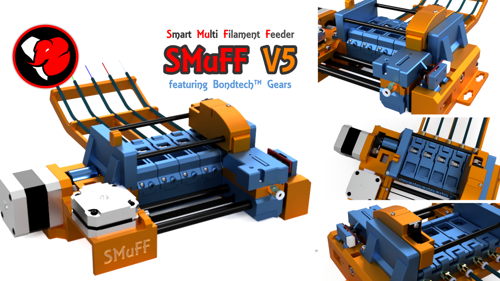

# Welcome to the SMuFF project

Here's the official firmware package for the **S**mart **Mu**lti **F**ilament **F**eeder, as published on [Thingiverse](https://www.thingiverse.com/thing:3431438). Read the full story here on the official [SMuFF homepage](https://sites.google.com/view/the-smuff/).

If you like this project and find it useful, please consider donating.

To use this firmware, you have to [compile it](https://sites.google.com/view/the-smuff/how-to/tutorials/compile-the-firmware?authuser=0) and flash it to one of these (already supported) controller boards:
+ the [SKR mini V1.1](https://www.aliexpress.com/item/33030594091.html?spm=a2g0o.productlist.0.0.e3fe7d4de7t12F&algo_pvid=ffbbb716-871c-4ebd-95eb-b68c9e99cea3&algo_expid=ffbbb716-871c-4ebd-95eb-b68c9e99cea3-2&btsid=b2bcac4f-54c8-4542-9243-e4c24264a3cf&ws_ab_test=searchweb0_0,searchweb201602_,searchweb201603_53)
+ the [SKR mini E3-DIP V1.1](https://www.biqu.equipment/products/bigtreetech-skr-e3-dip-v1-0-motherboard-for-ender-3)
+ the [SKR mini E3 V1.2](https://www.biqu.equipment/products/bigtreetech-skr-mini-e3-control-board-32-bit-integrated-tmc2209-uart-for-ender-4)
+ the [SKR mini E3 V2.0](https://www.biqu.equipment/products/bigtreetech-skr-mini-e3-v2-0-32-bit-control-board-integrated-tmc2209-uart-for-ender-4?_pos=3&_sid=ecb22ada6&_ss=r).

The SKR mini series boards are very small and yet more powerful because of the 32-Bit STM micro controller unit.

Of course, this firmware can be configured to run on any other controller board, as long as it meats the specifications. Although you might be able to utilize older 8 bit boards, it's not recommended - you'll most probably run out of memory (Flash/RAM) very soon. It's recommended using a 32 bit controller board instead.
Make sure your board of choice has least **256K** of Flash memory, **48K** of (S)RAM and all other components needed, which are (at least):

+ two stepper motor driver (sockets)
+ two endstop connectors
+ one servo connector
+ an onboard SD-Card
+ a 128 x 64 pixel display (connector)
+ a rotary encoder (connector)

Simply create a new build environment in your **platformio.ini** and adopt the settings according to your controllers hardware in your custom **pins.h** file.

The configuration file **SMuFF.cfg** has to be copied to the SD-Card of the controller board. Hence, changing runtime parameters doesn't require recompiling the firmware. Just edit the settings from within the menus, save them and reboot.

From version 1.6 on, I've added the option to run GCode scripts for automated testing of your hardware.
In the **test** folder you'll find some sample scripts. Copy those over to your SD-Card and pick one from within the menu to start the test run. Once started, the test will run infinitelly until you hit the encoder button.
Each test result will be displayed on the LCD and also sent to the log serial port (USB).

For more information about building the SMuFF and some more detailed stuff, head over to the official [SMuFF homepage](https://sites.google.com/view/the-smuff/).

---

## Recent changes

**2.14** - yet another bug fixing seesion

+ **Attention:** Renamed almost all parameters in SMUFF.CFG and TMCDRVR.CFG because of memory issues. Don't use your existing ones but rather copy the new files from this repository to your SD-Card
+ increased memory allocation for config files (reading TMCDRVR.CFG failed)
+ removed scanning for I2C devices when not using any I2C components (USE_CREALITY_DISPLAY will fail because of this)
+ updated code for Multiservo
+ corrected colors for RGB backlit displays
+ re-enabled remapping of SPI3/1 in case it's needed (via STM32_REMAP_SPI flag)
+ enabled all __debug() messages in setup() for easier troubleshooting. Once your SMuFF is starting up correctly, recompile firmware without DEGUB flag to get rid of them
+ **Notice:** BTT TFT V3.0 will work in 12864 emulation mode but the encoder button does not. I assume it's a firmware bug since an original Ender-3 display works flawless (using -D USE_CREALITY_DISPLAY flag at compilation). This may not be the case if you've already updates your TFT firmware.

**2.13** - bug fixing

+ removed  the "playing tunes in background" feature since it was causing hands and resets.
+ added parameter help on most of the GCodes when appending a question mark (?) to the command (i.e. M280?)

**2.12** - mostly code refactoring and a couple of new features

+ overhauled the intro in this README
+ added the [SKR mini E3 **V2.0**](https://www.biqu.equipment/products/bigtreetech-skr-mini-e3-v2-0-32-bit-control-board-integrated-tmc2209-uart-for-ender-4?_pos=3&_sid=ecb22ada6&_ss=r) controller board to the build environments. Keep in mind that this controller board uses one hardware serial (Serial4) for communication with the TMC2209 stepper drivers and thus, the drivers are enumerated through the MS1/MS2 pins. Hence, you must setup the *DriverAddress* in the TMC configuration accordingly.
+ added support for the [LeoNerd OLED Module](https://www.tindie.com/products/leonerd/oled-front-panel-module/) as an replacement for my DIY display/encoder board.
This PCB is an out-of-the-box solution and is controlled completely through the TWI/I2C interface. Hence, it'll need only 4 wires to connect with (5 if RESET gets wired up too).
The slightly bigger OLED display (1.3") is also an improvement in terms of readability.
To activate it, set the **USE_LEONERD_DISPLAY** definition instead of **USE_xxx_DISPLAY** in platformio.ini.
*If you order one at the tindie store, make sure you to refer to the SMuFF project since you'll need a slightly modified firmware on the module.*
+ moved Materials from **SMUFF.CFG** into **MATERIALS.CFG** due to low memory issues when reading/writing the configuration file.
+ moved TMC settings from **SMUFF.CFG** into **TMCDRVR.CFG** due to low memory issues when reading/writing the configuration file.
+ added the F"*filename*" parameter to **M300**, which enables you to play a tune directly from SD-Card via GCode command.
+ added cursor keys evaluation (*Up*, *Down*, *Left*, *Right*) to the serial interface for controlling the menus via terminal (mainly for testing). *Up* and *Down* emulate the encoder wheel, *Right* the encoder wheel button and *Left* emulates clicking the "**Back**" option.
+ moved U8G2 library wrappers into a separate file (see U8G2Wrappers.cpp).
+ changed the behaviour in the menus UI so that separators will be skipped automatically.
+ moved list of available commands into files (mcmds.txt and gcmds.txt) to save memory. Therefore, you have to copy the **help** folder to your SD-Card.
+ moved menus and menu options into files located in the **menus** and **options** folders. Therefore, you have to copy those folders to your SD-Card.
+ moved the tune files into the **sounds** folder. Copy this folder to your SD-Card as well.
+ added I2C devices scanner at startup. If you compile for debug, you'll get a list of recognized I2C devices. Known devices will be shown by their names.
+ added support for the Adafruit Multiservo controller for up to 16 servos. Might come in handy in future versions (V5.x). To use this feature, you have to compile with the **-D MULTISERVO** option defined. **Please notice**: In version 2.4.0, this library will compile with error when using on the STM32 framework. You have to change the code manually and remove the 3rd parameter in call of *requestFrom* in the line that the compiler complains about.
+ refactored the source code quite heavily in order to keep the memory footprint (RAM) as low as possible.
**Please notice**: If you're about to add your own extensions in the firmware, try keeping the RAM usage **well below 90%**. Otherwise you may experience random hangs/resets because heap memory will colide with stack memory!
+ added *LBtnDown*, *LBtnHold*, *RBtnDown*, *RBtnHold* settings in SMUFF.CFG for **LeoNerd's OLED module**. Theses will take any GCode, which will be processed as the event occurs. This will enable you to configure the two soft buttons as you need them (i.e. Motors Off - M18 or Reset M999). The *RBtnHold* is predefined to open/close the lid servo if no other GCode has been applied to.
+ renamed **servoRevolver** to **servoLid** for better understanding.
+ renamed **Acceleration** to **AccelSpeed** in **SMUFF.CFG**.
+ added **MS3** to stepper sections of **SMUFF.CFG**. This setting is needed on the SKR E3-DIP, since the MS3 signal (used to setup the micro stepping) is connected to the MCU and thus needs to be set via software in case you have to. The setting can be either **0** (don't care), **1** (for setting it to LOW) or **2** (for setting it to HIGH).
+ refactored *smuffConfig* structure in SMuFF.h.
+ added individual servo closed position to each tool. This makes it easier to apply the right amount of pressure to each lid, especially when using the new levered lid closing mechanism. Changing the closed position from within the menu will take the currently selected tool into account.
+ replaced *NULL* with *nullptr* to avoid any compiler ambiguity in future releases.
+ added stall detection logic to the feeder as well. If you're going to use this feature, be aware that it'll slow down the feed speed to about a third of the normal speed. Though, it'll reduce feed errors and thus make the SMuFF more reliable. Read all about the setup [here](https://sites.google.com/view/the-smuff/how-to/tutorials/set-up-the-tmc2209?authuser=0).

**2.11** - More streamlining / bug fixing

+ **changed the speed settings** in configuration file, menus and GCode interface to **mm/s**. The timer tick value was kind of confusing and misleading.
+ dumped **MaxSpeedHS** parameter since it's not really needed and confuses people.
+ fixed a couple of bugs induced in 2.10.
+ optimized code for TMC2209 stepper driver and stall detection/handling.
+ all sounds can now be modified and are contained in the **.DAT* files of the **Tunes** folder.
+ added new parameters to [M205 GCode](https://sites.google.com/view/the-smuff/tips-hints/talk-to-the-smuff?authuser=0#h.g5l7kws0923c) command.

**2.10** - A lot of changes, such as TMC driver support; **Please read on**

+ finished the implementation of the Duet3D Laser Sensor (V2) which can be used as the Feeder endstop and is able to monitor filament jams.
+ added GCode **M412** which will switch on/off runout/jam detection or report its status, when using a Duet3D Laser Sensor.
+ removed configuration file variants. There's only one general config file left.
+ renamed configuration file from **.CFG** to **.CFG.json**. This makes it easier for some after market *VS-Code extensions* to validate and format its content. **Please notice:** This file is meant as a template for your initial configuration. Make sure you rename the template file to "**SMuFF.CFG**" after you've copied it onto the SMuFF's SD-Card.
+ added GCode **M17** which enables you to switch a relay in order to switch from external stepper (3D-Printer) to internal stepper (SMuFF). The parameter must either be **E** for the **external** or **I** for the **internal** stepper. The relay is controlled over the **RELAY_PIN** in Pins.h. Read more about this [new feature here](https://sites.google.com/view/the-smuff/work-in-progress?authuser=0#h.qbpb6pvlq20x).
+ overhauled Settings Menu (moved additional settings into Options menu).
+ added **Serial0Baudrate** (for USB port) to config files, renamed **SerialDueBaudrate** to **Serial3Baudrate**.
+ fixed a bug for the old Revolver version where it refused to home correctly.
+ added defines for SERVO_LID and SERVO_WIPER for better code readability.
+ changed the behavior of boolean inputs (YES/NO and HI/LO) in the menus (they're single click now).
+ changed the increments on all stepper speeds (they'll now increment/decrement by 5).
+ moved some of the most common build flags (i.e. USE_xxx_DISPLAY) to the top of [platformio.ini](https://sites.google.com/view/the-smuff/how-to/tutorials/compile-the-firmware?authuser=0#h.3e6724efr6vl).
+ moved all initializing functions into **SetupInit.cpp**. SMuFF.cpp and setup() got much more streamlined now.
+ moved all periodical functions into **Periodicals.cpp**.
+ periodicals are now called from within **loop()**, which makes them more stable when handling serial I/O.
+ added the [SKR mini E3 V1.2](https://www.biqu.equipment/products/bigtreetech-skr-mini-e3-control-board-32-bit-integrated-tmc2209-uart-for-ender-4) and [SKR mini E3 DIP V1.1](https://www.biqu.equipment/products/bigtreetech-skr-e3-dip-v1-0-motherboard-for-ender-3) to the collection of usable boards.
+ rewrote the timers code. Encoder, Servos and Fans are now being served by one general purpose timer only. Servos are far less jittery now.
+ added *TMC-Stepper library* for being able to support TMC2209 stepper drivers.
+ added TMC-Params to the stepper menus. You'll need those settings at least on the SKR mini **E3**, on the SKR mini **E3DIP** when using TMC2209s.
+ added GCodes **M122**, **M350**, **M569**, **M906** and **M914** for handling TMC stepper driver settings (see Marlin GCode what they're used for).
+ got the USB port working on E3 and E3 DIP on Windows.
+ added a couple of more parameters supported by the [M205 GCode](https://sites.google.com/view/the-smuff/tips-hints/talk-to-the-smuff?authuser=0#h.g5l7kws0923c) command.

**2.09** - Bugfix for PMMU mode

+ fixed the bug which didn't realize the **A**(bort) command comming from Marlins MMU code
+ added **SOFTRESET** option for Marlin in MMU2 mode. This will not initiate a hard reset on the SMuFF, instead it'll pretend to have been reset. This option was needed because some bootloaders will send various information over the serial interface at boot and thus confuse the MMU2 code in Marlin.
+ added build flag **MARLIN2_ONLY** to overcome incompatibilities between Marlin 2.0 and Prusa firmware. Remove this build flag **only** when you're intending to run the SMuFF on a Prusa MK2/3/S.

**2.08** - Added Display menu in settings

+ new menu "Display" in settings lets you define stuff as Power save timeout, LCD Contrast and Backlight color
+ Backlight color of either RGB or NeoPixel displays will be saved to the SMuFF.CFG
+ added **M150** to set LED color (RGB or NeoPixel) via GCode. Parameters are same as on Marlin. Parameter **C*x*** allows you to set all LEDs to one of the predefined color indices (Black, Red, Green, Blue, Cyan, Magenta, Yellow, White) starting with 0 for Black (i.e. *M150 C4* sets all LEDs to Cyan). Parameter **S*n*** lets you define the LED index on NeoPixel LED stripes (starting at index 0 for first LED).

**2.07** - Added FastLED to project

Since some displays nowadays come with an NeoPixel backlight, I've seen the urge to add the FastLED library, which controls NeoPixels in a very comfortable way.
Though, on the STM32 Maple framework it will not compile right away, but there's a workaround. Please read the comments above the initFastLed() function carefully.

**2.06** - Changes for USB connection

+ made the USB serial port available for controlling the SMuFF. Comes in handy when operating on OctoPrint (Raspberry Pi), might not work on Windows though.
+ added some more //action: commands for OctoPrint plugin

**2.05** - Optimization for external control (i.e. OctoPrint plugin)

+ added WipeSequence setting to *SMuFF.CFG*.
This setting defines how the wiper servo will run. The sequence is a string in the format "**S**nn **I**nn **J**nn **P**nn **R**nn". Where **S** defines the speed (wait in millis between each movement), **I** defines the angle of the first position while wiping, **J** the angle of the second position, **P** the angle of the released position and **R** the number of repeats between **I** and **J**. This sequence will be overridden if passed as paramters of the **G12** GCode command.
+ changed "Servo cycles" to "Servo 2 cycles" and added "Servo 1 cycles", so each servo has it's individual settings

**2.04** - Optimization for OctoPrint plugin

+ added option to continously send status informations (current tool, endstop states) every two seconds
+ added option to engage/disengage 2nd servo via GCode (M280 P1 R0/1)
+ added filter for printable characters only while receiving data
+ added wrap for u8x8_byte_arduino_2nd_hw_spi in order to use SPI3 for the RepRap display on the SKR Mini V1.1
+ added wrap for u8g2_UserInterfaceMessage in order to be able still receiving commands from the serial interfaces

**2.03** - Minor changes

+ maxed out the number of  tools to 15.
+ added option to build firmware to be flashed from the SD-Card for the SKR mini V1.1 in order to prevent the stock bootloader from being overwritten.
+ fixed bug on ESP32 build in ZServo.cpp.

**2.02** - Added more support for SMuFF V5

+ changed some strings in the settings for V5.
+ removed Revolver settings if compiled for SMuFF_V5.
+ added Servo open/close in main menu.
+ added Tool Maintanance in main menu - this one moves the selector carrier two tools either left or right, so you can easily access the current tool if needed.
+ added Servo min. and max. PWM settings in the CFG file. These are representing the PWM signal length in microseconds. Usually set to 1000 (1ms) for 0 deg and 2000 (2ms) for 180 deg.
+ added Servo_Test.gcode to the test folder. Run this to test the positioning of your Revolver-Servo. Make sure the servo is able to reach all positions between 0 and 180 deg before you execute this test run.
+ added GCode command **TM** to the GCode-Parser whitch toggles the Tool Maintanance mode.
+ reworked the ZServo library for STM32 to get a stable and clean 50 kHz signal for driving the servos. Please notice that some micro servos are not very good in handling 3.3V PWM signals. Hence, the servo pins on the SKR mini have moved to the control signals of the Y-Stepper driver (if compiled for SMuFF_V5), which allow 5V tolerance and Open-Drain mode. This comes in handy, as the output PWM signals then can be pulled up to 5V.

**2.01** - Added support for a custom ESP32 controller board.

+ Please notice that this board doesn't exist yet. If you're keen to build one, you'll find the circuit diagramm in the Schematics folder. The base for this controller board is a ESP32 "NodeMCU devkit1" which is easy to get.
+ cleaned up platformio.ini. Be aware that from V2.xx on 8 bit controllers (such as the ATMega2560) will not be supported for this project anymore and the firmware code might not compile correctly.
+ tested configurations for other boards like the SKR 1.3/1.4. Theses boards can't yet be used as controller boards for the SMuFF because the framework for LPC176x MCUs do not support the Arduino standard and compiling will fail without adding some sort of HAL to it. Though, as the development of these platforms improve rapidly, this might not be an issue in the future anymore.

---

**1.67** - Bugfix for SKR in Duet3D mode

+ fixed sending endstop states to wrong serial port for Duet3D. Please notice: In Duet3D mode you **must use** the Serial 1 (the one labeled TFT on the board). Serial 3 will not receive the endstop states, which are needed to make the scripts on the Duet3D work correctly.

**1.66** - Buxfix for Wanhao i3 mini

+ fixed compile time error in ZServo for Wanhao i3
+ fixed compile time warnings for Wanhao i3

**1.65** - Minor changes - mainly for servo variant

+ changed the servo timing (duty cycle was twice as long as it's supposed to).
+ added live position change while configuring the servo positions in the menu (opened/closed).
+ added option to set up the servo pulse cycles (0 means: cycle forever, any value above 0: cycle only *n* times). *Set this value to about 2-3 if you experiencing jitter on the servo.*
+ added "**UseServo**", "**ServoOpened**" and "**ServoClosed**" parameters to M205 GCode command.

**1.64** - Minor changes

+ reworked the acceleration/deceleration algorithm for the stepper motors.
+ changed some default speed settings in the SMuFF.cfg file for SKR (due to the reworked acceleration/deceleration).
+ modified some of the test scripts for automated testing.
+ added M98 GCode to enable startig test runs from GCode (M98 P"filename" - omit the file extension ".gcode"). *Please notice: Since serial communication is disabled during test runs, you'll have to stop them by pressing the encoder button.*
+ reworked timer usage on STM32.
+ reworked servo library.

**1.63** - Minor changes

+ Wiggling the Revolver is now an option in the settings.
+ Added Feed error count to test run info display.
+ Added ok/missed feeds to test run. You'll need a 2nd endstop at the end of the bowden tube, which gets connected to the X+ endstop port on the SKR mini.
+ On feed errors, firmware will now retry 4 times before giving up. On second retry it'll home and reset the Selector. On third retry it'll go through all tools and retract the filament a bit (to prevent other tools/filaments blocking the Selector), then reposition the Selector as well.
+ Modified the servo module, so that it can handle more than one servo. Also, redefined the pins for the servo in the Pins.h. Servos are now driven by the endstops Y+ and Z+ ports.
+ Added experimental code to replace the Revolver stepper motor with an standard sized servo. This is still work in progress.

**1.60** - New enhancements

+ restructured the Main Menu.
+ added **Settings Menu** - *now, almost all parameters can be changed comfortably through the UI and saved to the SD-Card.*.
+ added long click to main screen for a quick access of the *Settings Menu*.
+ added long click in each setting dialog to close the dialog and discard the changes made.
+ added M500 (save to EEPROM) and M503 (read EEPROM) GCodes. Latter will give you a JSON format output, like the contents of the SMUFF.CFG file.
+ dropped the **Materials** section from within the configuration file due to memory limitations on the ATMega (make sure you remove it completely from your config file, otherwise your controller might hang on startup).
+ added **Reset Feeder Jam** to the *Main Menu*, dropped the double click action for this from last version.
+ did some code clean up, extracted menu- and dialog functions into separate files.
+ moved the ClickEncoder library source into the project since I needed some code enhancements (resetButton).
+ added **Testrun Menu** - an integrated test function (SKR only) - *place scripts with GCodes on the SD-Card which will get executed one by one in an continous loop*.
+ added some test scripts to the **test** folder - *copy those onto your SD-Card o  use them* .

**Please notice:**
This version will be the last one compatible with the **Wanhao i3 mini** (or 8-Bit in general)!
With the development going on, the memory limitations on 8-Bit devices are a real deal breaker.
For example: The only way to reach the *Settings Menu* screen is the long click on the main screen. The way it works on the SKR mini (through the *Main Menu*) crashes on the ATMega because of low working memory. For the same reason I've got to leave out the testrun option.

Hence, I've decided to focus on the 32-Bit devices in future versions.
If you've already assembled your SMuFF with the Wanhao i3 mini controller, it's fine. There's no need to switch over to the SKR mini unless you *really badly need* some of the enhancements and extensions that may come in the future.

**1.56** - Optimization

+ added resetting the "Feder Jammed" state by double clicking the encoder button.
+ removed the ZPwm.cpp / ZPwm.h since it's not needed.

**1.55** - Optimization

+ reworked Revolver movement - much smoother now.
+ optimized stepper motor speeds for SKR in configuration file.
+ Tools swapping is now being stored in the EEPROM.DAT file so that swaps will survive a reset.
+ added Cancel / Retry option when loading fails.
+ sound (beeper) now works flawlessly on SKR (STM32).
+ SKR still has issues with the fan (it's either full speed or no speed).

**1.53** - This version has got some major changes:

+ Full integration of the SKR mini V1.1 controller board (STM32) completed.
+ Prusa MMU2 Emulation mode improved even more.
+ Heavy refactoring to make the code better readable.
+ Optimized memory usage (all strings are now located in PROGMEM).
+ replaced the Rotary Encoder library.
+ Header files are now located in the include folder.
+ Pins header file separated into subfolders for different devices (uses the  -I compiler directive).
+ Added Configs folder containing different configuration samples for the modes/controllers.
+ Platformio.ini modified to allow different build environments.
+ Moved datastore from EEPROM to SD-Card (mainly because of the STM32).
+ Indexer for Materials in SMUFF.CFG renamed from Tool0..x to T0..x (because of memory issues).
+ Added *FeedChunks* and *EnableChunks* settings to SMUFF.CFG. Those are needed since the communcation on the 2nd serial port tends to hand in long operations (such as feeding the filament to nozzle) and Prusa won't be able to abort the feed.
+ Added *StepDelay* setting to SMUFF.CFG for the SKR Mini. This is needed because of the speed of an 32 bit board to keep the steppers from stalling.
+ Added schematics of the SKR Mini LCD board.

**1.4**  - Major changes to gain better compatibility for Prusa Emulation Mode and setup for a different platform (STM32). Latter is unfinished yet.
The configuration file (SMUFF.CFG) has got a new setting which defines the distance from the filament guide to the Selector (see *SelectorDist* setting).

**1.3**  - Some modifications to gain Prusa MMU2 compatibility

**1.2**  - Initialy published version
